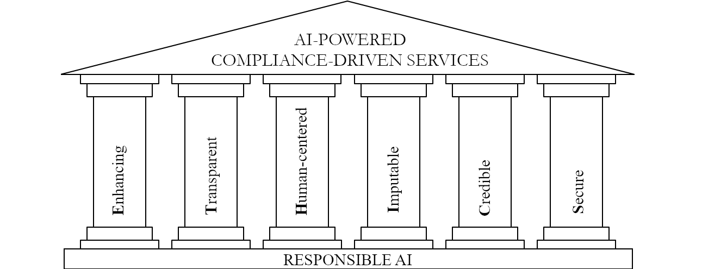

# ETHICS Responsible AI 
### Template and Case Studies

[License: Apache-2.0]

  
This repo provides actionable, lightweight artifacts and quality gates:  
- Artifacts: model card, GenAI system card, adverse action reason card, data card, validation report  
- Governance scoring: ETHICS System X-Ray (42 checkpoints -> ATS/PTS/IGB band)  
- ML model risk management: inventory, risk tiering, development documentation, validation, findings, monitoring, change control, third-party due diligence  
- Reproducibility: pinned deps, scripts, CI, report artifacts  
- Quality gates: data/drift (Evidently), fairness (Fairlearn), SBOM/security (Trivy)  

The six pillars: **E**nhancing, **T**ransparent, **H**uman-Centered, **I**mputable, **C**redible, **S**ecure.  

References:  
[1] Leandro A. Loss, *ETHICS: A Six-Pillar Framework for Responsible AI in Highly Regulated Industries*, 2026.  
[2] Leandro A. Loss, *ETHICS: A Six-Pillar Framework for Responsible AI in Finance*, The 2nd Workshop on LLMs and Generative AI for Finance (ACM ICAIF'25) [under review], 2025.

Quick start:  
1) Copy this repo as a template. Choose a license (default: Apache-2.0).  
2) Put your evaluation data at data/processed/eval.csv with columns: y_true, y_score, group (and optional y_pred).  
3) Edit config/project.yaml, config/accuracy_metrics.yaml and config/fairness_config.yaml (set acceptance thresholds).  
   - In project.yaml, fill human_baseline (what the current process achieves) and cost_benefit before claiming improvement. A gain measured against nothing is not a gain.  
4) Fill templates in /templates — start at [templates/README.md](templates/README.md), which says which artifact applies at which lifecycle stage. Assign a MODEL_ID at intake and carry it across every artifact.  
5) Score the ETHICS System X-Ray: copy templates/checklists/ethics_xray.csv per system/version and fill the score column (0-3, evidence-based). Complete it jointly (business owner, technical lead, risk/compliance, and the people who use or supervise the system) rather than alone.  
6) Run locally:   
   - pip install -r requirements.txt  
   - python scripts/run_quality_checks.py  
   - python scripts/run_fairness.py
   - python scripts/run_accuracy_metrics.py --config config/accuracy_metrics.yaml
   - python scripts/run_ethics_xray.py --xray templates/checklists/ethics_xray.csv
7) Push to GitHub; CI will publish reports to the Actions artifacts.  
   - CI is red until you supply data/processed/eval.csv and a scored X-Ray. That is intentional: an unfilled assessment must not pass as a zero-risk one.  
8) Link artifacts in PRs to support reviews and audits.  
  
Open-source tools:  
- Fairlearn: https://fairlearn.org  
- AIF360: https://github.com/Trusted-AI/AIF360  
- Great Expectations: https://greatexpectations.io  
- Evidently: https://github.com/evidentlyai/evidently  
- Trivy (vuln scan/SBOM): https://github.com/aquasecurity/trivy  
- Syft (SBOM): https://github.com/anchore/syft  
- Grype (SCA): https://github.com/anchore/grype

Project structure:

ETHICS/  
├─ README.md  
├─ LICENSE  
├─ templates/  
│  ├─ README.md              # artifact index: which artifact, which stage, what it feeds  
│  ├─ model_card.md  
│  ├─ adverse_action_card.md  
│  ├─ data_card.md  
│  ├─ validation_report.md  
│  ├─ genai_system_card.md  # LLM/RAG/agentic systems (prompts, retrieval, reconstruction)  
│  ├─ checklists/  
│     ├─ rai_checklist.md  
│     ├─ ethics_xray.md       # ETHICS System X-Ray: 42 checkpoints, scale, IGB bands  
│     ├─ ethics_xray.csv      # machine-readable scoring sheet  
│     └─ controls_map.csv  
│  └─ mrm/                  # ML model risk management (SR 11-7 / SS1/23 shaped)  
│     ├─ README.md           # methodology, lifecycle, ETHICS <-> SR 11-7 crosswalk  
│     ├─ model_inventory.csv  
│     ├─ model_risk_tiering.md  
│     ├─ model_development_document.md  
│     ├─ validation_plan.md  
│     ├─ model_findings_log.csv  
│     ├─ ongoing_monitoring_plan.md  
│     ├─ change_control.md  
│     ├─ governance_and_raci.md  
│     └─ third_party_model_due_diligence.md  
├─ config/  
│  ├─ project.yaml           # gates, human baseline, cost/benefit, oversight monitoring  
│  ├─ accuracy_metrics.yaml  # detailed accuracy report and its gates  
│  └─ fairness_config.yaml  
├─ data/  
│  ├─ raw/.gitkeep  
│  └─ processed/.gitkeep   # place eval.csv here (y_true, y_score, group)  
├─ reports/.gitkeep        # CI will write HTML/JSON here  
├─ scripts/  
│  ├─ run_quality_checks.py  
│  ├─ run_fairness.py  
│  ├─ run_accuracy_metrics.py  
│  └─ run_ethics_xray.py  
├─ .github/workflows/  
│  ├─ quality-gates.yml  
│  └─ security.yml  
├─ requirements.txt  
├─ .pre-commit-config.yaml  
├─ SECURITY.md  
├─ CODE_OF_CONDUCT.md  
├─ CONTRIBUTING.md  
├─ case-studies/  
│  └─  ...  
  
Notes:  
- Not legal advice. Align adverse action content with counsel and policy.  
- Do not commit raw PII or licensed data. Use secrets and approved data paths.  
- Never commit private keys or credentials. Pre-commit runs detect-private-key; keep SSH keys in ~/.ssh, outside the repo.  
